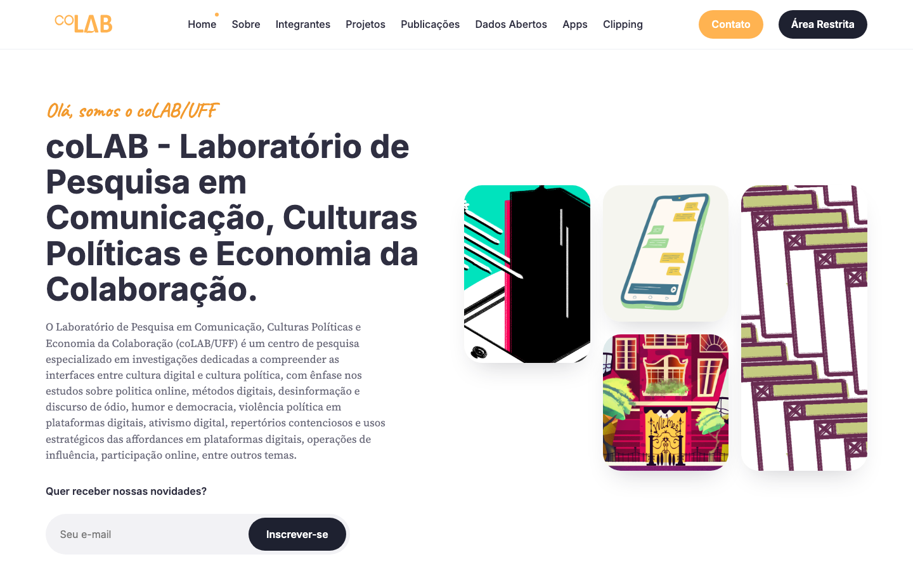

# coLAB — site institucional

Este é o repositório do site oficial do **coLAB — Laboratório de Pesquisa em Comunicação, Culturas Políticas e Economia da Colaboração**, sediado na Universidade Federal Fluminense (UFF) desde sua fundação, em 2010, com vinculação ao Programa de Pós-Graduação em Comunicação e ao Departamento de Estudos Culturais e Mídia.

O coLAB é um centro de pesquisa especializado em investigações dedicadas a compreender as interfaces entre cultura digital e cultura política, com ênfase nos estudos sobre política online, métodos digitais, desinformação e discurso de ódio, humor e democracia, violência política em plataformas digitais, ativismo digital, repertórios contenciosos e usos estratégicos das affordances em plataformas digitais, operações de influência, participação online, entre outros temas.

Acesse o site oficial em **[colab.meme](https://colab.meme)**.
